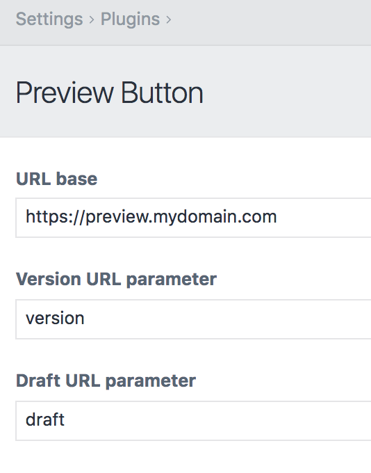
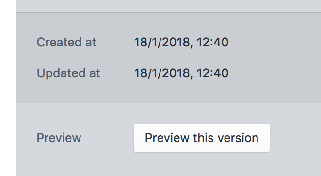

# Preview Button plugin for Craft CMS 3.x

Adds a preview button to the entry editor screen to allow previewing of draft/revision entries

## Requirements

This plugin requires Craft CMS 3.0.0-beta.23 or later.

## Installation

To install the plugin, follow these instructions.

1. Open your terminal and go to your Craft project:

        cd /path/to/project

2. Then tell Composer to load the plugin:

        composer require biglotteryfund/preview-button

3. In the Control Panel, go to Settings → Plugins and click the “Install” button for Preview Button.

## Preview Button Overview

Sites that make use of the [Element API](https://github.com/craftcms/element-api) may not benefit from Craft's preview features if they're not making use of templating. This plugin adds a button to the Entry editing screen which links to a preview URL with `?draft=$id` or `?version=$id` parameters so your backend can look up content from the correct place.

It's your responsibility to write the backend code to fetch these revisions/drafts, but this plugin should allow you to give users a way to preview content directly from the editing screen.

## Configuring Preview Button

There are three settings:

### 1. URL base
This will replace your `siteUrl` for the entry's URI (eg. you may wish to serve preview content on a subdomain or subfolder of your main site).

### 2. Version URL parameter (optional)
This will be appended to the preview URI along with the ID of the version, eg. `?version=$id`.

### 3. Draft URL parameter (optional)
This will be appended to the preview URI along with the ID of the draft, eg. `?draft=$id`.

## Using Preview Button

Install the plugin, configure a URL base as a minimum, and edit an entry in draft/revision mode. You should see a button below the entry fields:

## Preview Button Roadmap

Possibly supporting more advanced URL construction and configuring which entry types or user roles can see the preview button.

--

Brought to you by [Big Lottery Fund](https://www.github.com/biglotteryfund)
